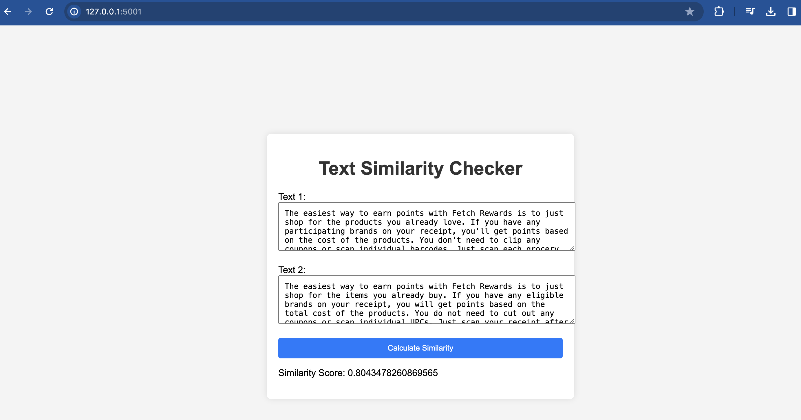

# Text Similarity Python Application

## Overview
This Python application calculates the similarity between two texts using basic natural language processing techniques. It features a web interface allowing users to input texts directly and view the calculated similarity score.

## Features
- Text preprocessing (removing punctuation, converting to lowercase).
- Calculation of word frequencies.
- Similarity metric based on the intersection of unique words.
- Web interface for dynamic text input and real-time similarity calculation.

## Requirements
- Python 3.x

## Installation
To install the required dependencies:
```bash
pip install -r requirements.txt
```

## Usage
To use the application, run the `app.py` script with Python. This will start a local web server that hosts the text similarity interface.

### Running the Script
1. Download or clone this repository.
2. Navigate to the directory containing `app.py`.
3. Run the script using the command:
   ```bash
   python app.py
   ```
4. Open a web browser and go to `http://127.0.0.1:5001` to access the application.

## How It Works
The application includes several key functions:
- `preprocess_text(text)`: Cleans the input text by removing punctuation and converting it to lowercase.
- `word_frequencies(text)`: Splits the text into words and calculates the frequency of each word.
- `calculate_similarity(text1, text2)`: Calculates the similarity between two texts based on the overlap of unique words.
- The web interface provides a form for users to input two texts and see their similarity score.

The similarity score ranges from 0 (no similarity) to 1 (identical texts).

## Web Interface
The application features a simple yet functional web interface where users can:
- Input two different texts into provided text boxes.
- Submit the texts for similarity calculation.
- View the resulting similarity score directly on the web page.

# Sample Output



## Contributing
Contributions to this project are welcome. Please fork the repository and submit a pull request with your proposed changes.

## License
This project is open source and available under the [MIT License](LICENSE).
